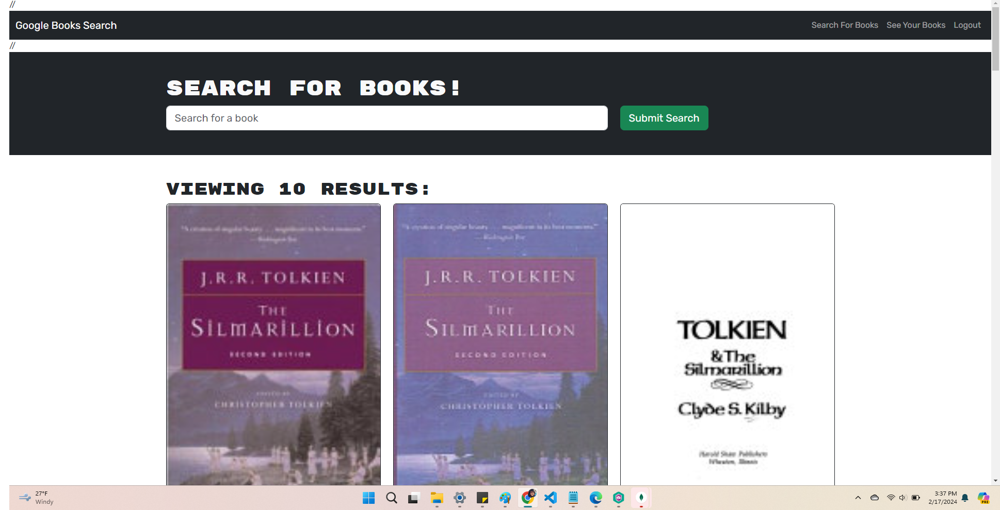

# 21 MERN: Book Search Engine
A Book Search Website that lets you create a profile. You can search for books, and save them to your profile to view later.

## Description
Uses MongoDB and Mongoose for Database Management. React was used for front end. 

## Installation
Run  'npm i'  to install dependencies.

## Usage
Create an account using the create an account tab in the upper right.
Search for books in the search bar.
Add books using the button at the bottom of each book card.
View your books by clicking "See Your Books" at the top right.
Delete books by clicking "Delete Books" at the bottom of each card in your books tab.

Link to github repository.
https://github.com/kingbgreen5/book-search

Link to Deployed Application
https://blog-site-bk-77edcaeea42f.herokuapp.com/

=======

## Credits
Starter code heavily used and provided by Bootcamp lessons.
 

## License
MIT

